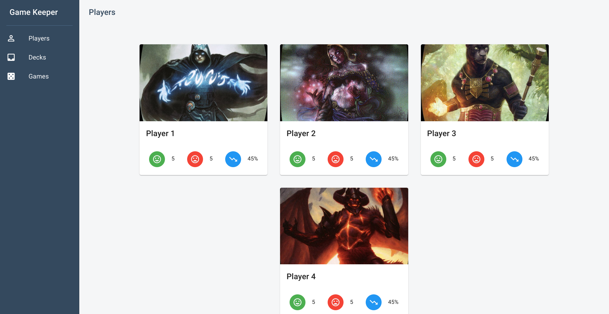
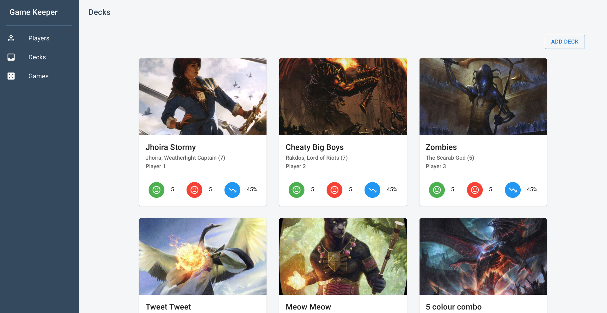
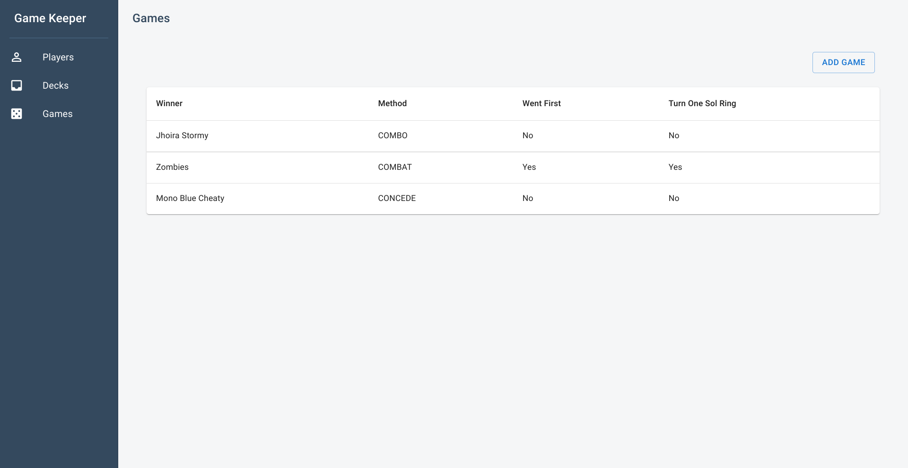

<h1>
  Game Keeper
</h1>

  App to record magic the gathering players, decks and game results.

  The app makes use of the <a href="https://scryfall.com/docs/api">Scryfall API</a> for card info and images.

<h3>
  Stack
</h3>
<ul>
  <li>FaunaDB</li>
  <li>Netlify Lambdas</li>
  <li>Gatsby</li>
  <li>React</li>
  <li>Material UI</li>
</ul>

<h3>
  Screenshots
</h3>

